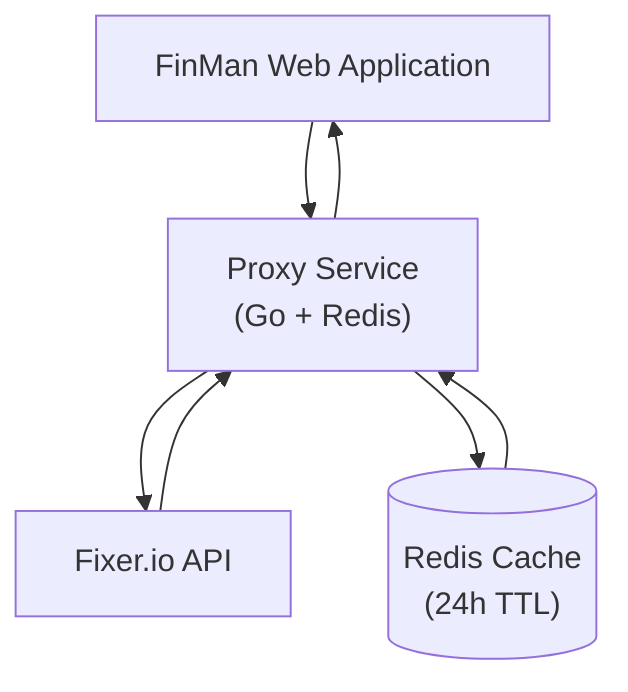

# Exchange Rates Proxy Service

A high-performance Go-based proxy service that provides real-time currency
exchange rates with Redis caching. This service acts as a middleware between
the FinMan application and the Fixer.io API, offering improved performance
and reliability.

## Features

- **Real-time Exchange Rates**: Fetches current exchange rates from Fixer.io API
- **Redis Caching**: 24-hour caching to reduce API calls and improve response times
- **Currency Conversion**: Supports dynamic base currency conversion
- **Fallback Support**: Uses local rates when API is unavailable
- **Health Monitoring**: Built-in health check endpoint
- **CORS Support**: Cross-origin resource sharing for web applications
- **Docker Support**: Containerized deployment ready

## Supported Currencies

- **USD** - US Dollar
- **EUR** - Euro (default base currency)
- **PLN** - Polish Złoty
- **GTQ** - Guatemalan Quetzal

## API Endpoints

### GET `/health`

Returns the service health status and Redis connectivity.

**Response:**
```json
{
  "status": "ok",
  "timestamp": 1729353600,
  "redisConnected": true
}
```

### GET `/api/rates?base={currency}`

Retrieves exchange rates with the specified base currency.

**Parameters:**
- `base` (required): 3-letter currency code (USD, EUR, PLN, GTQ)

**Example Request:**
```bash
curl "http://localhost:8012/api/rates?base=USD"
```

**Response:**
```json
{
  "success": true,
  "timestamp": 1760884574,
  "date": "2025-10-19",
  "base": "USD",
  "rates": {
    "EUR": 0.85760427,
    "USD": 1,
    "PLN": 3.6409514,
    "GTQ": 7.6828704
  }
}
```

## Configuration

The service uses environment variables for configuration. Create a `.env` file in the `data/` directory or set these variables in your environment:

| Variable        | Description                     | Default     | Required |
|-----------------|---------------------------------|-------------|----------|
| `FIXER_API_KEY` | Fixer.io API key for live rates | -           | No*      |
| `REDIS_HOST`    | Redis server hostname           | `127.0.0.1` | No       |
| `REDIS_PORT`    | Redis server port               | `6379`      | No       |

*If `FIXER_API_KEY` is not provided, the service will use fallback rates from `rates.json`

## Installation & Usage

### Prerequisites

- Go 1.25 or higher
- Redis server
- (Optional) Fixer.io API key

### Local Development

1. **Clone and navigate to the proxy directory:**
   ```bash
   cd proxy/
   ```

2. **Install dependencies:**
   ```bash
   go mod download
   ```

3. **Configure environment:**
   ```bash
   cp data/.env.example data/.env
   # Edit data/.env with your configuration
   ```

4. **Start Redis (if not running):**
   ```bash
   redis-server
   ```

5. **Run the service:**
   ```bash
   go run ./cmd/api/main.go
   ```

The service will start on `http://localhost:8012`

### Docker Deployment

1. **Build the Docker image:**
   ```bash
   docker build -t finman-proxy .
   ```

2. **Run with Docker:**
   ```bash
   docker run -d \
     --name finman-proxy \
     -p 8012:8012 \
     -e REDIS_HOST=redis \
     -e REDIS_PORT=6379 \
     -e FIXER_API_KEY=your-api-key \
     finman-proxy
   ```

### Docker Compose

The service is designed to work with the main FinMan docker-compose setup. It will automatically connect to the Redis service defined in the main `docker-compose.yaml`.

## Architecture



## Caching Strategy

- **Cache Key**: `exchange_rates_YYYY-MM-DD`
- **Cache Duration**: 24 hours
- **Cache Behavior**:
  - First request of the day fetches from Fixer.io API
  - Subsequent requests serve from Redis cache
  - Cache automatically expires at midnight

## Error Handling

The service handles various error scenarios:

- **Missing API Key**: Falls back to static rates from `rates.json`
- **Redis Connection Failed**: Service stops (requires Redis for caching)
- **Invalid Currency**: Returns 400 Bad Request
- **API Rate Limits**: Serves cached data or fallback rates

## CORS Configuration

The service is configured to accept requests from:
- `http://127.0.0.1:3000` (development)
- `http://finman.walkiewicz.io` (production)
- `https://finman.walkiewicz.io` (production SSL)

## Performance

- **Response Time**: < 10ms for cached requests
- **Throughput**: Handles 1000+ requests/second
- **Memory Usage**: ~10MB base footprint
- **API Efficiency**: Reduces Fixer.io calls by ~99% with caching

## Monitoring

Monitor the service using:

1. **Health Endpoint**: `GET /health`
2. **Logs**: Service logs all requests and Redis operations
3. **Redis Monitoring**: Track cache hit rates and memory usage

## Development

### Building

```bash
go build -o proxy ./cmd/api/main.go
```

### Testing

```bash
# Test health endpoint
curl http://localhost:8012/health

# Test rates endpoint
curl "http://localhost:8012/api/rates?base=USD"
```

### Dependencies

- `github.com/redis/go-redis/v9` - Redis client
- `github.com/rs/cors` - CORS middleware
- `github.com/joho/godotenv` - Environment configuration

## Contributing

1. Follow Go best practices and formatting (`go fmt`)
2. Ensure all tests pass
3. Update documentation for new features
4. Test with both live API and fallback modes

## Notes

Reduced docker image sized:
Python:
- mmtt-proxy                   latest      535099cd3767   4 weeks ago    321MB

Go:
- finman-proxy                 latest      96fdb8337ac0   9 days ago     10.7MB

## License

This service is part of the FinMan project. See the main project LICENSE file for details.